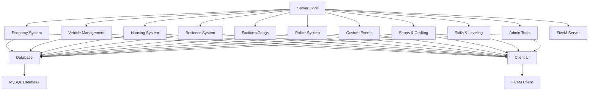

# CYV RP Framework Roadmap

## Overview
This document outlines the high-level roadmap for developing the custom FiveM server framework for CYV RP. The framework will provide a comprehensive role-playing experience with modular components for player management, economy, and social systems.

## Architecture
- **Modular Design**: Each system (player, inventory, economy, etc.) will be implemented as separate modules for maintainability
- **Database Integration**: MySQL with oxmysql for data persistence
- **Client-Server Model**: Server-side logic with client-side UI and interactions
- **Event-Driven**: Custom events for inter-module communication

## Core Components
1. **Economy System**
    - Job system with salaries
    - Money transactions
    - Banking system

2. **Vehicle Management**
    - Vehicle ownership and spawning
    - Garage system
    - Vehicle customization

3. **Housing System**
    - Property ownership
    - Furniture and customization
    - Rental system
    - Buyable mansions with premium features

4. **Business System**
    - Drug dealing operations
    - Business ownership and management
    - Profit sharing and expansion
    - Illegal activities integration

5. **Factions/Gangs**
    - Group management
    - Territory control
    - Member roles and permissions

6. **Police System**
    - Law enforcement mechanics
    - Wanted system
    - Jail and fines

7. **Custom Events**
    - Server-wide events
    - Seasonal activities
    - Community challenges

## Additional Features
- Shops and marketplaces
- Crafting system
- Skills and leveling
- Admin/moderation tools
- Logging and analytics

## Development Phases
1. **Phase 1**: Core Infrastructure - Establish the foundational structure and database setup
2. **Phase 2**: Essential Systems - Implement core player and economic mechanics
3. **Phase 3**: Advanced Features - Add complex systems like vehicles, housing, and businesses
4. **Phase 4**: Specialized Systems - Integrate police and event management
5. **Phase 5**: UI Development - Create comprehensive user interfaces
6. **Phase 6**: Advanced Systems - Implement additional features like crafting and skills
7. **Phase 7**: Testing and Polish - Finalize with testing, optimization, and deployment

## System Architecture Diagram

## Dependencies
- oxmysql for database operations
- NativeUI or similar for client-side menus
- EssentialMode or custom base for core functions