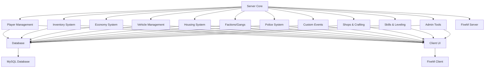

# CYV RP Framework Roadmap

## Overview
This document outlines the high-level roadmap for developing the custom FiveM server framework for CYV RP. The framework will provide a comprehensive role-playing experience with modular components for player management, economy, and social systems.

## Architecture
- **Modular Design**: Each system (player, inventory, economy, etc.) will be implemented as separate modules for maintainability
- **Database Integration**: MySQL with oxmysql for data persistence
- **Client-Server Model**: Server-side logic with client-side UI and interactions
- **Event-Driven**: Custom events for inter-module communication

## Core Components
1. **Player Management**
   - Character creation and customization
   - Login/registration system
   - Player data persistence

2. **Inventory System**
   - Item management with metadata
   - Weight and capacity limits
   - Item usage and interactions

3. **Economy System**
   - Job system with salaries
   - Money transactions
   - Banking system

4. **Vehicle Management**
   - Vehicle ownership and spawning
   - Garage system
   - Vehicle customization

5. **Housing System**
   - Property ownership
   - Furniture and customization
   - Rental system

6. **Factions/Gangs**
   - Group management
   - Territory control
   - Member roles and permissions

7. **Police System**
   - Law enforcement mechanics
   - Wanted system
   - Jail and fines

8. **Custom Events**
   - Server-wide events
   - Seasonal activities
   - Community challenges

## Additional Features
- Shops and marketplaces
- Crafting system
- Skills and leveling
- Admin/moderation tools
- Logging and analytics

## Development Phases
1. **Phase 1**: Core infrastructure (directory structure, manifest, config)
2. **Phase 2**: Essential systems (player, inventory, economy)
3. **Phase 3**: Advanced features (vehicles, housing, factions)
4. **Phase 4**: Specialized systems (police, events)
5. **Phase 5**: Additional features and testing

## System Architecture Diagram

## Dependencies
- oxmysql for database operations
- NativeUI or similar for client-side menus
- EssentialMode or custom base for core functions